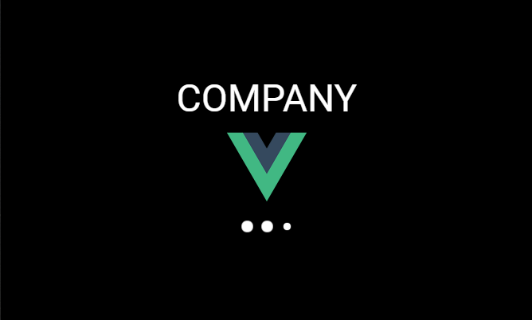
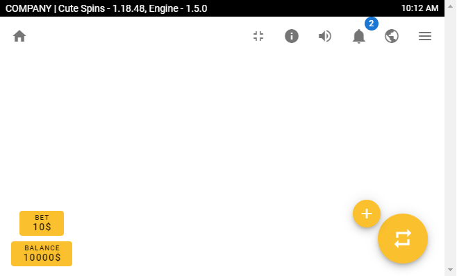

# Slot UI

> **Slot UI** is a video slot game user interface. Its a simple and elegant UI. Its meant to be ran along with a slot game. The slot game will be contained inside the frame of the slot ui.


<br/>


## Getting started

To get a local copy up and running follow these simple example steps.

## Project setup

```
yarn install
```

### Compiles and hot-reloads for development

```
yarn serve
```

### Compiles and minifies for production

```
yarn build
```

### Lints and fixes files

```
yarn lint
```

### Run example with

```
yarn example
```

### Customize configuration

See [Configuration Reference](https://cli.vuejs.org/config/).

## Usage guide

Use this space to show useful examples of how a project can be used. Additional screenshots, code examples and demos work well in this space. You may also link to more resources.

## Download

- The application is now available as a JAR file. Within the `dist/` directory of this repository the executable JAR file can be found.

## Future changes

- Improve usability

## Contact

For contact, you can reach me at [marjantanevski@outlook.com](marjantanevski@outlook.com).

## License

MIT © [Marjan Tanevski](marjantanevski@outlook.com)
